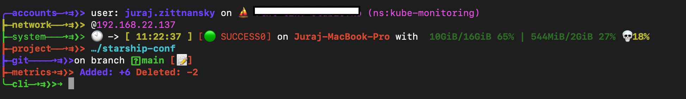

# starship-conf template

Install [Starship](https://starship.rs) and then add ```starship.toml``` to ```$HOME/.config/``` and reload your terminal 

Example (behind white rectangle is name of actual K8s cluster):



## Installation:

Installation if you do not want to read Starship documentation:

```bash
#Install
curl -sS https://starship.rs/install.sh | sudo sh #Linux
brew install starship #MacOS

./install_bash.sh #bash - Linux
./install_zsh.sh #zsh - MacOS
```
